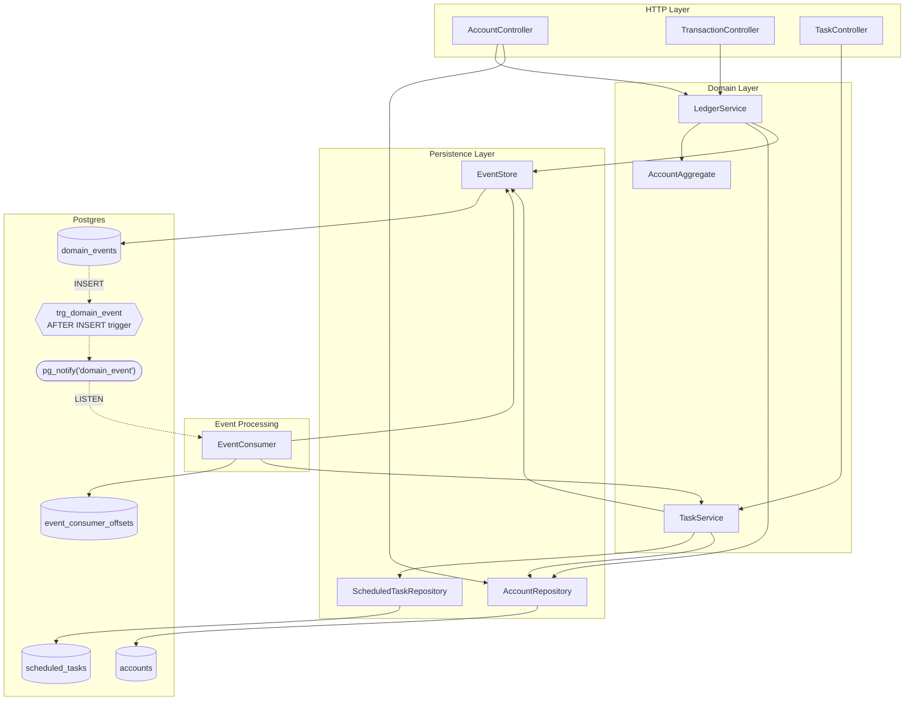
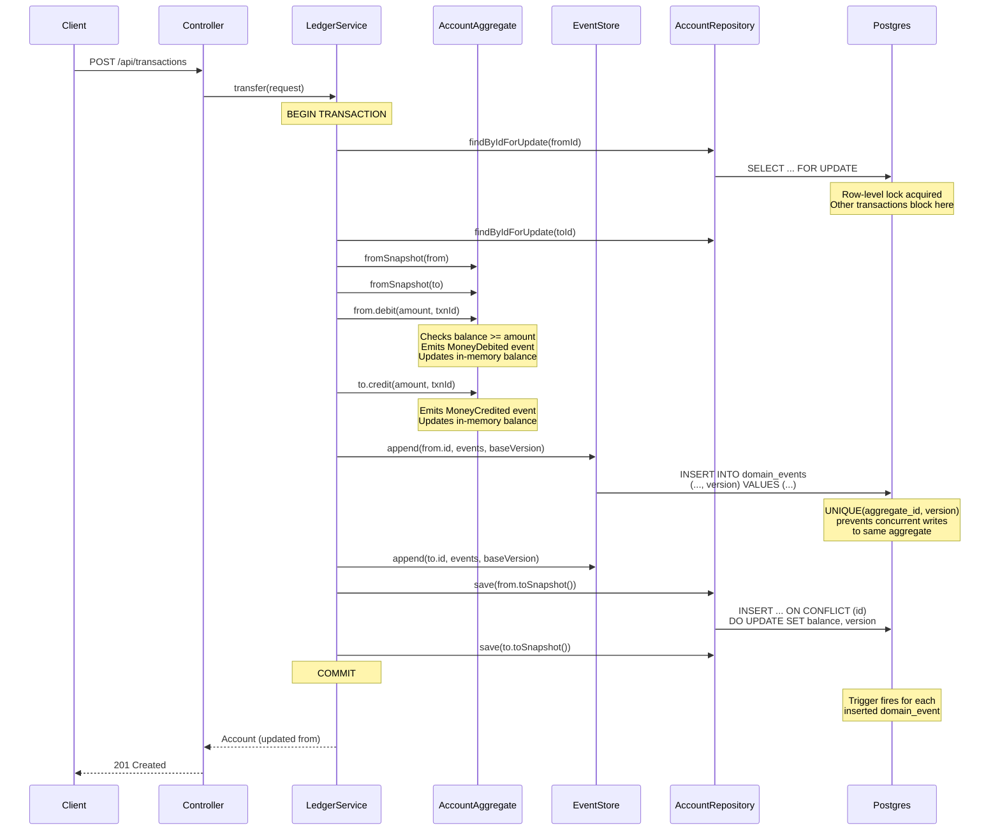
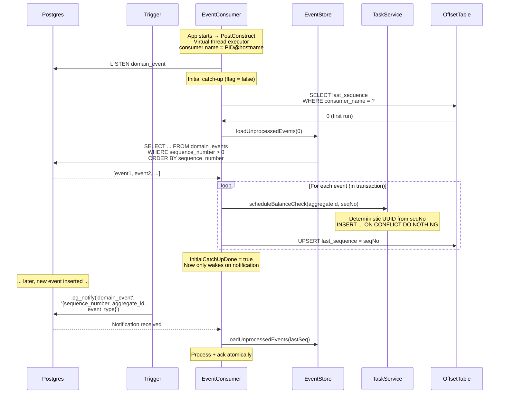
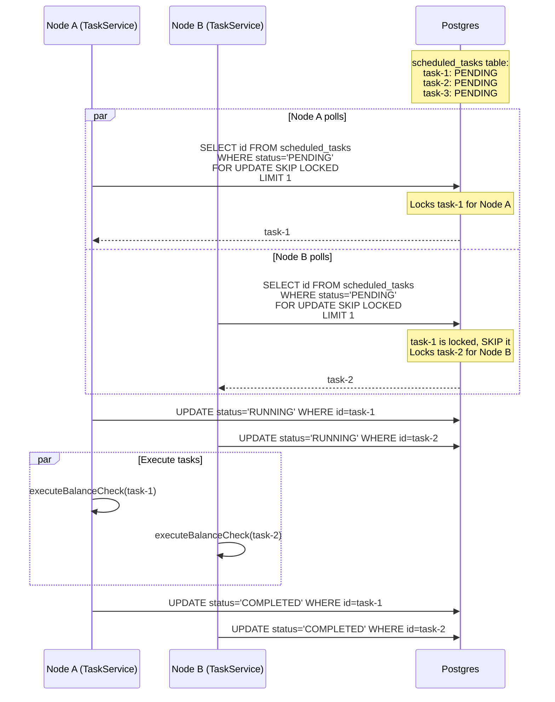
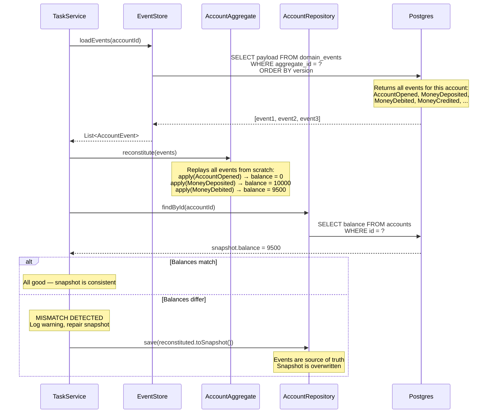
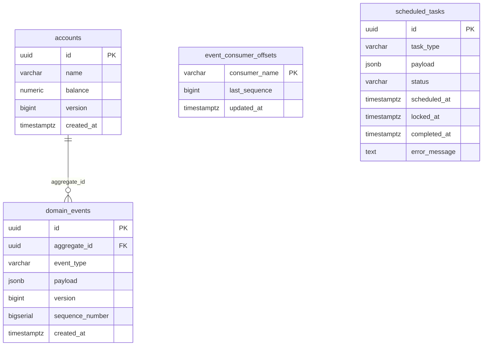

# Hesab Ketab Architecture

An event-sourced ledger built with Spring Boot and Postgres, using advanced Postgres features as the backbone for event storage, notification, and task processing.

## System Overview



## Event Sourcing: Write Path

When a transfer is executed, events are the source of truth. The account snapshot is a performance optimization, not the canonical state.



## Event Consumption: Postgres LISTEN/NOTIFY

Every app node listens for events and processes them independently. The offset table ensures each node tracks its own position. `pg_notify` is a signal, not a delivery mechanism — the actual events are read from the table.



### How pg_notify Works

```
┌──────────────────────────────────────────────────────────────────────────────┐
│                        Postgres LISTEN / NOTIFY                            │
├──────────────────────────────────────────────────────────────────────────────┤
│                                                                            │
│  1. TRIGGER fires AFTER INSERT on domain_events                            │
│     └─► pg_notify('domain_event', '{"sequence_number":42,...}')            │
│                                                                            │
│  2. Notification is BROADCAST to ALL connections that called:              │
│     LISTEN domain_event                                                    │
│                                                                            │
│  3. This is NOT a message queue:                                           │
│     - No persistence: if no one is listening, the notification is lost     │
│     - No acknowledgment: fire-and-forget                                   │
│     - No partitioning: every listener gets every notification              │
│     - Payload is just a signal (< 8KB), not the actual event data         │
│                                                                            │
│  4. The EventConsumer uses notifications as a WAKE-UP SIGNAL:              │
│     - On notification → query domain_events for new rows                  │
│     - On startup → catch-up query regardless (handles missed events)      │
│     - Fallback poll every 200ms (handles edge cases)                      │
│                                                                            │
│  5. Why not just poll?                                                     │
│     - pg_notify gives sub-second latency without DB load                  │
│     - Polling alone would need aggressive intervals → wasted queries      │
│     - Hybrid: notify for speed, poll for reliability                      │
│                                                                            │
└──────────────────────────────────────────────────────────────────────────────┘
```

## Multi-Node Consistency

```mermaid
graph LR
    subgraph "Node A (PID: 1234)"
        EC_A[EventConsumer<br/>consumer-1234@host]
        TS_A[TaskService]
    end

    subgraph "Node B (PID: 5678)"
        EC_B[EventConsumer<br/>consumer-5678@host]
        TS_B[TaskService]
    end

    subgraph "Postgres"
        EVENTS[(domain_events)]
        OFFSETS[(event_consumer_offsets<br/><br/>consumer-1234@host → seq 42<br/>consumer-5678@host → seq 42)]
        TASKS[(scheduled_tasks)]
    end

    EVENTS -->|broadcast notify| EC_A
    EVENTS -->|broadcast notify| EC_B

    EC_A -->|read events from seq 40| EVENTS
    EC_B -->|read events from seq 40| EVENTS

    EC_A -->|update own offset| OFFSETS
    EC_B -->|update own offset| OFFSETS

    EC_A -->|"INSERT task (deterministic ID)<br/>ON CONFLICT DO NOTHING"| TASKS
    EC_B -->|"INSERT task (same ID)<br/>ON CONFLICT DO NOTHING"| TASKS

    TASKS -->|"claim: FOR UPDATE<br/>SKIP LOCKED"| TS_A
    TASKS -->|"claim: FOR UPDATE<br/>SKIP LOCKED"| TS_B
```

```
┌──────────────────────────────────────────────────────────────────────────────┐
│                        Multi-Node Guarantees                               │
├──────────────────────────────────────────────────────────────────────────────┤
│                                                                            │
│  IDEMPOTENT TASK CREATION                                                  │
│  ─────────────────────────                                                 │
│  Task ID = UUID.nameUUIDFromBytes("BALANCE_CHECK:<sequence_number>")       │
│  INSERT INTO scheduled_tasks ... ON CONFLICT (id) DO NOTHING               │
│                                                                            │
│  Both nodes process event seq=42 → both try to insert task with            │
│  same deterministic UUID → second insert is silently ignored.              │
│  Result: exactly one task, regardless of how many nodes process it.        │
│                                                                            │
│  ATOMIC PROCESS + ACK                                                      │
│  ────────────────────                                                      │
│  TransactionTemplate wraps processEvent() + updateOffset()                 │
│  If app crashes after processing but before offset update →                │
│  transaction rolls back → task insert AND offset update both reverted →    │
│  event will be reprocessed on restart → idempotent insert = safe.          │
│                                                                            │
│  COMPETING TASK CONSUMERS                                                  │
│  ────────────────────────                                                  │
│  SELECT ... FOR UPDATE SKIP LOCKED                                         │
│  Node A claims task 1, Node B skips it and claims task 2.                  │
│  No double-execution. Non-blocking — nodes never wait for each other.      │
│                                                                            │
└──────────────────────────────────────────────────────────────────────────────┘
```

## Task Processing: FOR UPDATE SKIP LOCKED

The task queue uses Postgres as a distributed job queue. `FOR UPDATE SKIP LOCKED` is the key feature that enables non-blocking concurrent task claiming.



```
┌──────────────────────────────────────────────────────────────────────────────┐
│                     FOR UPDATE SKIP LOCKED explained                       │
├──────────────────────────────────────────────────────────────────────────────┤
│                                                                            │
│  Standard FOR UPDATE:                                                      │
│    Thread A locks row 1 → Thread B BLOCKS waiting for row 1               │
│    Problem: serialized execution, no parallelism                           │
│                                                                            │
│  FOR UPDATE SKIP LOCKED:                                                   │
│    Thread A locks row 1 → Thread B SKIPS row 1, takes row 2               │
│    Result: parallel execution, non-blocking                                │
│                                                                            │
│  Combined with LIMIT 1 in a subquery:                                      │
│    UPDATE scheduled_tasks SET status = 'RUNNING'                           │
│    WHERE id = (                                                            │
│        SELECT id FROM scheduled_tasks                                      │
│        WHERE status = 'PENDING'                                            │
│        ORDER BY scheduled_at                                               │
│        FOR UPDATE SKIP LOCKED                                              │
│        LIMIT 1                                                             │
│    )                                                                       │
│                                                                            │
│  This is a Postgres-native job queue — no Redis, no RabbitMQ needed.       │
│                                                                            │
│  Partial index for performance:                                            │
│    CREATE INDEX idx_tasks_claimable ON scheduled_tasks(scheduled_at)        │
│    WHERE status = 'PENDING';                                               │
│    Only indexes pending tasks — completed tasks don't bloat the index.     │
│                                                                            │
└──────────────────────────────────────────────────────────────────────────────┘
```

## Balance Check: Event Replay vs Snapshot

The consistency task verifies that the materialized snapshot (accounts table) matches the event history (domain_events table).



## Transfer History: JSONB Joins

Transfer history is queried directly from the event store using JSONB expression joins — no separate transactions table needed.

```
┌──────────────────────────────────────────────────────────────────────────────┐
│                           JSONB Features Used                              │
├──────────────────────────────────────────────────────────────────────────────┤
│                                                                            │
│  JSONB COLUMN                                                              │
│  ────────────                                                              │
│  domain_events.payload is JSONB, not JSON.                                 │
│  JSONB = parsed binary format → faster queries, supports indexes.          │
│  JSON = raw text → must parse every read, no indexing.                     │
│                                                                            │
│  JSONB OPERATORS                                                           │
│  ───────────────                                                           │
│  payload->>'transactionId'     Extract text value (returns VARCHAR)        │
│  payload->>'amount'            Extract text, then cast: ::numeric          │
│  (payload->>'transactionId')::uuid   Cast extracted text to UUID           │
│                                                                            │
│  JSONB EXPRESSION INDEX                                                    │
│  ─────────────────────                                                     │
│  CREATE INDEX idx_domain_events_transaction_id                             │
│      ON domain_events ((payload->>'transactionId'));                        │
│                                                                            │
│  This indexes the extracted transactionId value from inside the JSONB.     │
│  Without it, every transfer query would do a full table scan and           │
│  parse every JSONB payload. With it, Postgres uses the index for           │
│  the JOIN condition.                                                       │
│                                                                            │
│  THE TRANSFER QUERY                                                        │
│  ─────────────────                                                         │
│  SELECT                                                                    │
│      (debit.payload->>'transactionId')::uuid  as transaction_id,           │
│      debit.aggregate_id                       as from_account_id,          │
│      credit.aggregate_id                      as to_account_id,            │
│      (debit.payload->>'amount')::numeric      as amount,                   │
│      debit.created_at                         as occurred_at               │
│  FROM domain_events debit                                                  │
│  JOIN domain_events credit                                                 │
│      ON debit.payload->>'transactionId' = credit.payload->>'transactionId' │
│      AND credit.event_type = 'MoneyCredited'                               │
│  WHERE debit.event_type = 'MoneyDebited'                                   │
│      AND (debit.aggregate_id = :accountId                                  │
│           OR credit.aggregate_id = :accountId)                             │
│                                                                            │
│  This self-joins domain_events to pair MoneyDebited + MoneyCredited        │
│  events that share the same transactionId, reconstructing the full         │
│  transfer (from → to) without maintaining a separate table.                │
│                                                                            │
└──────────────────────────────────────────────────────────────────────────────┘
```

## Concurrency Control: Pessimistic Locking

```
┌──────────────────────────────────────────────────────────────────────────────┐
│                        Aggregate Locking Strategy                          │
├──────────────────────────────────────────────────────────────────────────────┤
│                                                                            │
│  SELECT ... FOR UPDATE on the accounts table                               │
│                                                                            │
│  Thread A: transfer(Alice → Bob, $100)                                     │
│  Thread B: transfer(Alice → Charlie, $200)     (concurrent)                │
│                                                                            │
│  Thread A                          Thread B                                │
│  ─────────                         ─────────                               │
│  BEGIN                             BEGIN                                    │
│  SELECT * FROM accounts            SELECT * FROM accounts                  │
│    WHERE id='Alice'                  WHERE id='Alice'                      │
│    FOR UPDATE                        FOR UPDATE                            │
│    → locks Alice row                 → BLOCKS (waiting for A's lock)       │
│                                                                            │
│  -- A checks balance (9500)                                                │
│  -- A debits 100 → balance 9400                                            │
│  INSERT INTO domain_events ...                                             │
│  UPDATE accounts SET balance=9400                                          │
│  COMMIT                                                                    │
│    → releases lock                   → lock acquired!                      │
│                                      -- B sees balance = 9400 (updated)    │
│                                      -- B debits 200 → balance 9200       │
│                                      INSERT INTO domain_events ...         │
│                                      UPDATE accounts SET balance=9200      │
│                                      COMMIT                                │
│                                                                            │
│  UNIQUE(aggregate_id, version) on domain_events provides an additional     │
│  optimistic concurrency check — if two transactions somehow both read      │
│  the same version, the second INSERT fails with a unique violation.        │
│                                                                            │
└──────────────────────────────────────────────────────────────────────────────┘
```

## Database Schema



```
┌──────────────────────────────────────────────────────────────────────────────┐
│                          Key Schema Decisions                              │
├──────────────────────────────────────────────────────────────────────────────┤
│                                                                            │
│  BIGSERIAL sequence_number                                                 │
│  ─────────────────────────                                                 │
│  Auto-incrementing global sequence across all aggregates.                  │
│  Provides a total ordering of events — essential for the consumer to       │
│  know "give me everything after sequence X". The regular `version`         │
│  column is per-aggregate, so it can't provide global ordering.             │
│                                                                            │
│  UNIQUE(aggregate_id, version)                                             │
│  ─────────────────────────────                                             │
│  Optimistic concurrency control: two concurrent transactions writing       │
│  version 4 of the same aggregate → second one gets a unique violation.     │
│  This is the safety net behind the FOR UPDATE pessimistic lock.            │
│                                                                            │
│  CHECK constraint on status                                                │
│  ─────────────────────────                                                 │
│  CHECK (status IN ('PENDING', 'RUNNING', 'COMPLETED', 'FAILED'))           │
│  Enforced at the database level — invalid status values are rejected       │
│  regardless of which application or migration tries to insert them.        │
│                                                                            │
│  Partial index on scheduled_tasks                                          │
│  ────────────────────────────────                                          │
│  CREATE INDEX ... WHERE status = 'PENDING'                                 │
│  Only indexes the rows that matter for claiming. As tasks complete,        │
│  they leave the index. The index stays small even with millions of         │
│  completed tasks.                                                          │
│                                                                            │
│  JSONB expression index                                                    │
│  ─────────────────────                                                     │
│  CREATE INDEX ... ON domain_events ((payload->>'transactionId'))            │
│  Indexes a computed value extracted from JSONB. Postgres evaluates         │
│  the expression at INSERT time and stores the result in the B-tree.        │
│  Queries using the same expression hit the index instead of scanning.      │
│                                                                            │
└──────────────────────────────────────────────────────────────────────────────┘
```
